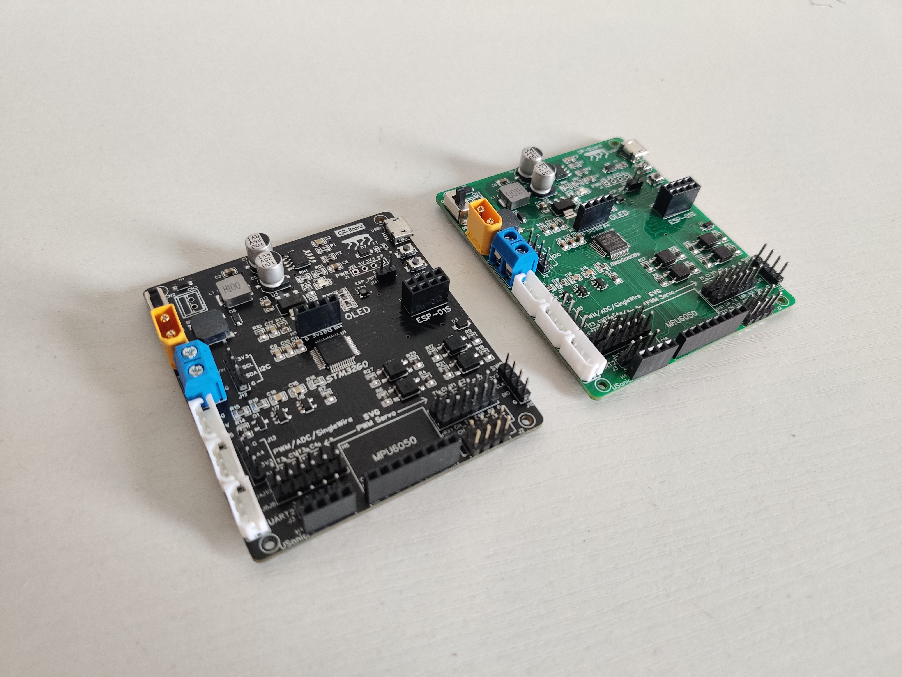

## 四足机器人控制板QR-Board


## 1 简介

QR-Board是一块基于STM32G0微控制器的四足机器人控制板，支持一系列四足机器人常用硬件模块（例如舵机、IMU、超声测距、WiFi、OLED等模块）的接入，并提供了完善的使用例程，能方便地完成机器人等应用功能的开发。板载功能演示视频和硬件工程开源地址如下：

[Bilibili：QR-Board板载功能演示](https://www.bilibili.com/video/BV1KF411n76f?spm_id_from=333.999.0.0)

[OSHWHub：QR-Board立创EDA工程](https://oshwhub.com/yoohgc/QR-Board)



## 2 硬件资源

原理图和PCB的PDF文件位于`hardware`文件夹下

> **双MCU应用**

STM32G070CBT6微控制器，64MHz主频，128KB FLASH，36KB SRAM，支持SWD/UART程序下载

ESP-01S WiFi模组，可基于Arduino编程或AT指令控制，支持UART程序下载

> **板载外设接口**

8个光耦隔离的5V PWM舵机接口

3个飞特scs系列总线舵机接口

1个MPU6050模块接口

1个I2C OLED模块接口

1个HC-SR04超声测距模块接口

1个USB转TTL MicroUSB通信接口

XT30公头或螺钉式端子DC5V~15V直流供电，支持ADC电压测量

支持I2C/UART通信，引出PWM/ADC/GPIO等富余接口

## 3 软件例程

### 3.1 软件工具

- STM32CubeMX
- MDK-ARM Keil5

### 3.2 板级支持包

提供12个板级支持包例程，位于`bsp_demo`文件夹下

| 序号 | 工程名称   | 工程描述                                                     |
| ---- | ---------- | ------------------------------------------------------------ |
| 1    | led        | RGB三色LED灯板级支持包，支持LED亮、灭、电平翻转、流水灯      |
| 2    | key        | 基于multi_button的按键板级支持包，支持按键的单击、双击、长按 |
| 3    | pwmbuzzer  | 无源蜂鸣器板级支持包，由PWM驱动发声，支持蜂鸣器的开、关、发声频率设置 |
| 4    | pwmservo   | PWM舵机板级支持包，由周期20ms（高电平占0.5ms至2.5ms）的PWM驱动，支持8路舵机的0°至180°的输出 |
| 5    | scservo    | 飞特SCS系列总线舵机板级支持包，由串口USART2驱动              |
| 6    | smservo    | 飞特SMS系列总线舵机板级支持包，由串口USART2驱动              |
| 7    | mpu6050    | MPU6050模块板级支持包，由模拟I2C驱动，支持三轴陀螺仪和加速度计原始数据、模块温度、基于DMP解算的欧拉角等数据的获取 |
| 8    | stm32flash | STM32内部FLASH板级支持包，支持STM32内部FLASH的按页读写       |
| 9    | rtt        | rt-thread板级支持包，提供静态和动态线程的创建示例            |
| 10   | battery    | 电池板级支持包，采用ADC+DMA获取锂电池电压                    |
| 11   | esp8266    | ESP8266模块板级支持包，ESP8266模块通过串口USART1与STM32连接并发送数据，STM32采用DMA+IDLE解析来自ESP8266模块的数据帧 |
| 12   | hcsr04     | HC-SR04模块板级支持包，采用PWM输入捕获和状态机实现超声测距信息的获取 |

### 3.2 工程文件结构

板级支持包的工程文件分为两大部分，一部分是由STM32CubeMX自动生成的，一部分是自己添加的，以mpu6050模块为例，其工程文件结构如下

```shell
mpu6050
 ├─BSP
 ├─LIB
 │  └─mpu6050
 ├─MDK-ARM 
 ├─Drivers 
 ├─Core
 ... 
```

`/BSP`目录下是自己编写的板级支持包文件，对外提供各类板载功能接口；

`/LIB`目录下是调用的外部库文件；

其余文件均为STM32CubeMX自动生成

### 3.3 命名约定

良好的编程命名规则有利于快速索引和匹配所需的对象，提高编程效率。该板级支持包编程命名规则与STM32HAL库类似，具体规则如下：

1、函数命名

函数命名包括三部分，板级支持包+模块名称+函数具体动作，两两之间下划线分隔，函数具体动作采用大驼峰式命名法

```c
BSP_LED_Init();           // led初始化
BSP_MPU6050_GetData();    // 获取mpu6050的数据
```

2、类型命名

类型命名包括两部分，模块名称+类型名，两者之间下划线分隔，类型名采用大驼峰式命名法

```c
// esp8266消息结构体
typedef struct { 
  int len;
  uint8_t *buf;
} ESP8266_Msg;

// led类型枚举
typedef enum { 
  RED = 0,
  GREEN,
  BLUE
} LED_Type;
```

3、变量命名

变量命名采用全小写，下划线分隔

```c
float bat_voltage = 0; // 电池电压
```

4、宏和常量

宏和常量采用全大写，下划线分隔

```c
#define LED_NUM (2)    // led的数量
const int LED_NUM = 2; // led的数量
```

### 3.4 轻量级时间片

该板级支持包提供了一个轻量、易用的时间片轮询功能，位于`bsp_time`模块中，使用方法如下

1、提供一个1ms的时基

```c
// stm32 systick 1ms 中断
void SysTick_Handler(void)
{
  BSP_Time_IncTick(); // 时间片轮询时基
}
```

2、创建轮询任务

```c
int main(void)
{
  BSP_Time_Init(); // 时间片轮询初始化
  while(1)
  {
    if(BSP_Time_CheckTick() ==1 )
    {
       // 500ms轮询任务,绿色led闪烁
      if(BSP_Time_CheckSlice(500) == 1)
      {
        BSP_LED_Toggle(GREEN);
      }
      // 100ms轮询任务,更新hc-sr04超声测距模块的测量距离
      if(BSP_Time_CheckSlice(100) == 1)
      {
        BSP_HCSR04_UpdateDist();
      }
      // 1000ms轮询任务,获取并打印hc-sr04超声测距模块的测量距离
      if(BSP_Time_CheckSlice(1000) == 1)
      {
        float dist = BSP_HCSR04_GetDist();
        printf("dist is %.2f cm\r\n",dist)
      }
    }
  }
}
```

### 3.5 移植

利用STM32CubeMX生成工程，添加`/BSP`目录和对应的驱动文件，修改端口并添加驱动代码就能实现不同STM32微控制器的快速移植

